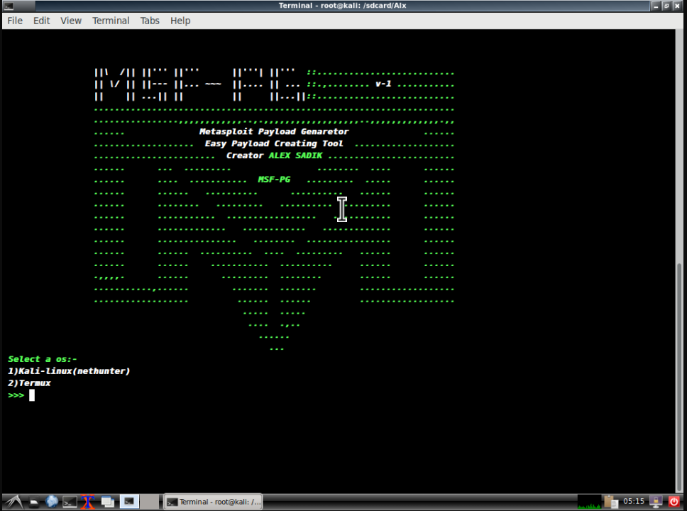
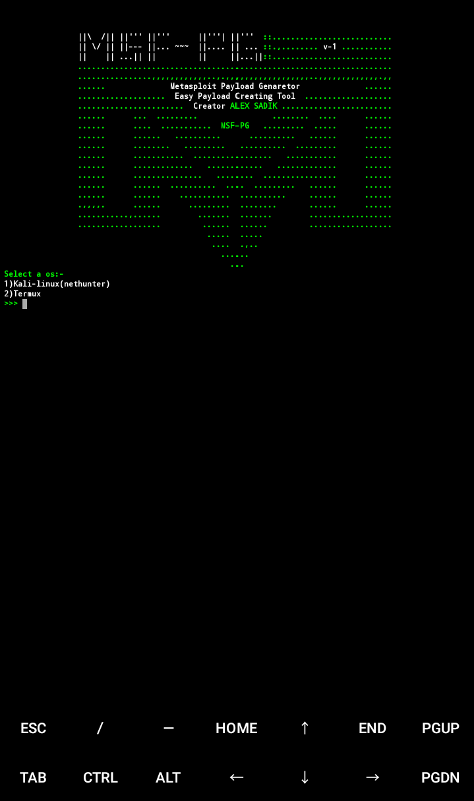

# Msf-Pg 

Small tool for genarate Payload 

 

# Installation

1]- apt update && apt upgrade

2]- apt install git

3]- git clone https://github.com/haxzsadik/MSF-Pg

4]- cd MSF-Pg;chmod +x msf-pg setup.sh

5]- ./setup.sh

Now you can run msf-pg anywhere

# Note

I don't responsiable for any missuse of this tool

I made this for imporve skills of beginners

if you got any bug in this tool or want any improve 

Then open issue or pull req is available
